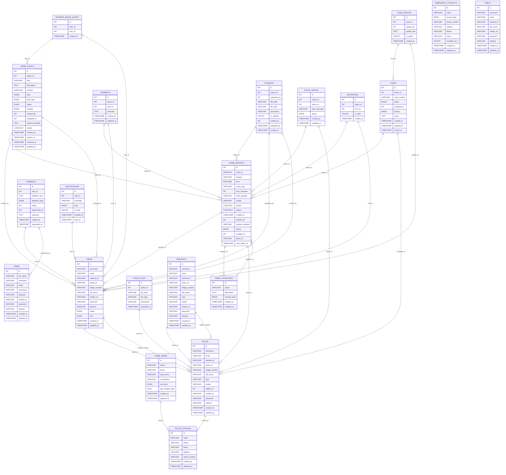

# ER Diagram for MySQL Schema

Below is the Entity-Relationship (ER) diagram for your MySQL database schema, represented using Mermaid syntax. You can view this diagram in Markdown viewers that support Mermaid diagrams (such as GitHub, GitLab, or VS Code with the appropriate extension).

